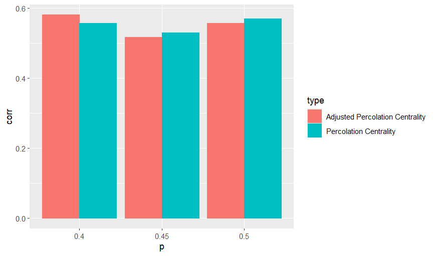

# Introduction

Epidemiology is a subject of much contemporary relevance. With the emergence of automated contact tracing technology, prophylactic identification and isolation of high-risk individuals could be practicable in the future. This study investigates methods for the identification of high-risk individuals in a temporal network.

We will begin by defining what is meant by "high-risk" in this context. Government's wish to intervene for individuals who are most instrumental in the spread of a disease. Therefore, risk is a combination of the likelihood of a particular individual becoming contagious due to prior contacts, and the likelihood of the individual spreading the illness via future contacts. In practice, future contacts are not known, therefore this study will assume perfect contact information up to the current time, and no future contact information.

Social networks can be modeled as a number of close personal contacts, each paired with a measure of proximity. Each contact is written as (i, j, t), where i and j are the interacting individuals, and t is the time of the interaction (note that (i, j, t) is semantically no different from (j, i, t)). This representation is called a temporal network, and it is frequently used in the study of epidemics. In practice, contact events are identified using contact tracing.

Contact tracing is a methodology for combating the spread of infectious diseases transmitted by close personal contacts. By uncovering close contact events, contact tracing can be used to identify people at high risk of infection, and foresee future growth or contraction of the epidemic. This information can inform further interventions (e.g. quarantining, disease tests, vaccination). Traditionally, contact tracing focused on confirmed cases, which were reported to authorities. When a new case is reported, an official asks the patient to recall all recent contacts. Although this method has been shown to be effective (@fetzer2021measuring), it is labor-intensive and reliant on accurate human recall. Recently, digital contact tracing has emerged as a cost-effective (albeit unreliable) alternative to conventional contact tracing methods. In it's latest incarnations, digital contact tracing uses portable bluetooth devices which detect close contacts between carriers of the device. In addition, digital contact tracing can provide indicators of proximity between the interacting individuals. Statistical methods are often used (in combination with contact tracing) to identify high-risk individuals in a social network. This study investigates two common methods for the analysis of contact tracing data: Simulation and Social Network Analysis (SNA).

Simulation is an effective method for ascertaining properties of a temporal network. Some classical models have been deterministic: the differential equation model of @kermack1927contribution is a notable example. However, deterministic models typically rely on simplifying assumptions, and thus do not capture the full granularity of the network. Compartmental models are a popular simulation approach in which the population is divided into groups, and individuals transition between groups over time. The Susceptible-Infected-Recovered (SIR) model is a quintessential compartmental model in which all individuals are initially susceptible, and individuals may become infected due to a contact with a contagious individual. Once infected, individuals transition to the recovered state at a predictable recovery rate, where they stay for the remainder of the simulation. Recovery rates are typically sampled from a probability distribution, which may be estimatable by exogenous information (e.g. medical knowledge, recovery rates for similar diseases). Key metrics are averaged over many simulations to approximate a true underlying distribution. A plethora of summary metrics have been applied to simulated epidemics. @macdonald1952analysis introduced the reproductive number, which is defined as the number of cases resulting from a single infection. @holme2018objective used the time for the disease to go extinct (i.e. no new cases can occur).

Social Network Analysis (SNA) is an interdisciplinary approach for the study of entities and their relationships with each other. SNA involves constructing a network to model a real-world situation of interest, and calculating metrics related to the network structure. These metrics can be broadly categorized into two types: Population-level measures and Individual-level measures. This study is primarily concerned with individual-level measures. Centrality is a commonly-used individual-level measure which is defined as the influence of a particular individual within a network. Prestige (sometimes called status or rank) is a similar individual-level measure for directional graphs, which only considers incoming dyads. Although SNA has been used in many fields since it's creation in the 1930s, it's value in epidemiology only became apparent in 1985, when @klovdahl1985social applied SNA to AIDS data.

To date, research on the SI model has largely been focused on computational simulations of many epidemics on a temporal network. In this paper, I propose several novel measures of prestige for temporal networks, and I apply them to the SI epidemiology framework.

# Methods

The New Zealand Ministry of Health (MoH) comissioned a pilot study of the "CovidCard", A portable device which used bluetooth technology to record contacts between carriers of the device. We use this data to validate existing centrality metrics, and develop novel alternatives.

## Study Site

The CovidCard pilot study was carried out in Ngontotahā, a small settlement situated in the Rotorua district. Ngontotahā was chosen because it met several key criteria, namely compactness, geographical isolation, small population size and high sociodemographic diversity.

## Sampling

Adults 19 years of age or older who live in Ngontotahā West and East were recruited to participate in a seven-day study. Additionally, people who live outside these boundaries but work within the Ngontotahā Village were also permitted to take part in the trial. In total, 1,191 people participated in the study. At the end of the trial period, a subset of 158 participants from the main trial were contacted by MoH case investigators to establish contacts that they had over the trial period using a modified version of the MoH case investigation protocol. The data collected through these investigations was important, as it was meant to provide a "ground truth" against which the CovidCard data could be validated.

## Data Description

The CovidCard is a bluetooth device developed for detecting close-contact events between carriers. Each card advertises it's presence and detects signals from other cards. Algorithms evaluate the radio signal strength indicator (RSSI) of close-contacts in real-time, and the signal strength is aggregated over 15 minute time intervals. Each interval was classified as either < 1 meter, < 2 meter and < 4 meter proximity, and the total number of intervals belonging to each class was summed over a two-hour period. The cards can hold up to 128 contact events in short-term cache memory at any given time, of which some are recorded in long-term flash memory. An interaction was recorded in flash memory if it was longer than 2 minutes in duration, and the RSSI exceeded -62dBm (roughly corresponding to a distance of less than 4 meters).

## Data Preparation

The last day of the trial period saw an anomalously high number of close-contacts, most likely because participants congregated at a single location to return the cards. For this reason, contact events which occurred on the last day of the trial were omitted. Data which could not be cross-verified by case investigation was removed, and duplicate contact events were omitted.

## Centrality

Centrality is roughly defined as the influence of a given node in a graph. The exact definition of a "central" node varies depending on the context.

## Degree Centrality

Degree centrality is a simple metric for static networks where we only consider the number of neighbors of a given node. Let A be the adjacency matrix for a static network i.e. $A_{ij}$ = 1 if i and j are neighbours and 0 otherwise. The degree centrality is defined as:

$$C_{D}(i) = \sum_{j = 1}^{N}{A_{ij}}$$
Degree centrality is simple and easily calculable, however it does not incorporate knowledge of the entire network structure. Improving this point is the motivation for our next centrality measure.

## Closeness Centrality

For undirected graphs, @bavelas1950communication proposed closeness centrality

$$C_{c}(\textit{u}) = \frac{N - 1}{\sum_{\upsilon \neq \textit{u}}d(\textit{u}, \upsilon)}$$
where N is the number of nodes and $d(\textit{u}, \upsilon)$ is the distance of the shortest path between $\upsilon$ and $\textit{u}$. Thus, referring to Figure 1, the closeness centrality of node E is $\frac{4}{1 + 1 + 2 + 3} = \frac{4}{7}$. Closeness centrality can be interpreted as the efficiency with which a node can access all other nodes in a network.

```{r, engine = "tikz", fig.cap = "A simple undirected graph", echo = FALSE}
\begin{tikzpicture}

\tikzset{vertex/.style = {shape=circle,draw,minimum size=1.5em}}
\tikzset{edge/.style = {->,> = latex}}

\node[vertex] (a1) at (0,-1) {$A$};
\node[vertex] (b1) at (0.5,1) {$B$};
\node[vertex] (c1) at (3,3) {$C$};
\node[vertex] (d1) at (-1,5) {$D$};
\node[vertex] (e1) at (3,7) {$E$};

\draw[thick] (a1) -- (b1);
\draw[thick] (a1) -- (c1);
\draw[thick] (a1) -- (d1);
\draw[thick] (e1) -- (c1);
\draw[thick] (d1) -- (e1);

\end{tikzpicture}
```

## Betweenness Centrality

In some situations, the effect that removing a node has on transmission through a network may be highly important (for instance, when quarantining individuals during an epidemic). This is the primary motivation behind Betweenness Centrality (@freeman1977set), which is defined as

$$C_{B}(\upsilon) = \frac{1}{(N - 1)(N - 2)}\sum_{s \neq v \neq r}\frac{\sigma_{s, r}(\upsilon)}{\sigma_{s, r}}$$
where $\sigma_{s, r}$ is the number of shortest paths (geodesics) between s and r, and $\sigma_{s, r}(\upsilon)$ is the number of such paths that pass through $\upsilon$. The denominator term, $(N - 1)(N - 2)$, ensures that the value is normalized between 0 and 1.

## Percolation Centrality

In practice, additional information around the percolation state of nodes may be known. For instance, in epidemiology we may know that certain individuals are infected. To incorporate knowledge of percolation state into centrality metrics, @piraveenan2013percolation proposed percolation centrality:

$$C_{P}^{t}(\upsilon) = \frac{1}{(N - 1)(N - 2)}\sum_{s \neq v \neq r}\frac{\sigma_{s, r}(\upsilon)}{\sigma_{s, r}}\frac{x_{s}^{t}}{[\sum{x_{i}^{t}}] - x_{\upsilon}^{t}}$$
where $x_{i}^{t}$ is the percolation state of node i at time t. The percolation state ranges from 0 to 1, where 1 means the individual is certainly infected, and 0 means the individual is healthy. A decimal value (say 0.6) could, for instance, represent a probability of infection or a proportion of a township which is infected.

## Adjusted Percolation Centrality

I propose a novel variant of percolation centrality, which I will call Adjusted Percolation Centrality. Adjusted Percolation Centrality only considers paths which do not pass through any percolated nodes. By doing this, it ensures that redundant paths are not considered. I will define an unpercolated path as a path where no incident nodes are percolated, except for the start and end nodes, which may have any percolation state. The mathematical definition is

$$C_{P}^{t}(\upsilon) = \frac{1}{M_{P}}\sum_{s \neq v \neq r}\frac{\sigma_{s, r}^{P}(\upsilon)}{\sigma_{s, r}^{P}}\frac{x_{s}^{t}}{[\sum{x_{i}^{t}}] - x_{\upsilon}^{t}}$$
where $M_{P}$ is the number of pairs (i, j) where there is an unpercolated path between i and j, and $\sigma_{s, r}^{P}$ is the number of shortest unpercolated paths between s and r.

## Epidemic Simulations for Static Networks

This section describes a novel approach to epidemic modelling using static networks, and I use it as a "ground truth" to validate Adjusted Percolation Centrality. A social network is modeled by a static graph, where each node represents an individual, and each edge represents an ongoing, time-independent relationship between two individuals. It is assumed that contacts between any two individuals i and j follows a Poisson Process with a rate parameter of $\lambda_{ij}$, and each contact has a constant probability, $\beta$, of being infectious. The sojourn times (period between contacts) of contacts between i and j follow an exponential distribution with a rate of $\lambda$.

**Lemma 1: Let Y follow a Poisson Process with rate $\lambda$, and X be the Markov process where for each arrival in Y, X includes the  arrival with probability p. Then X is a Poisson Process with a rate parameter of $p\lambda$.**

The proof of Lemma 1 is a well-known result which is not discussed here. Lemma 1 implies that the sojourn times of infectious contacts between i and j follow independent exponential distributions with a fixed rate parameter of $\beta\lambda_{ij}$. Due to the memorylessness property of the exponential distribution, the time until the next infectious contact, from any starting time, follows the same distribution. By these assumptions, epidemics can be efficiently simulated in the most general case, without prior knowledge of contacts. Consider a simulation ending at time T, which starts with a set of infected nodes. We iterate through all neighbours of each infected node, and sample a time until the next infectious contact, adding it to a sorted list of infection times as we go. At each subsequent step, the smallest infection time is selected from the list. If this time is greater than T, the simulation stops. Otherwise we sample an infection time for each neighbour of the infected node. If the sampled infection time for a given node is greater than it's current infection time, it is ignored. Figure 2 shows a static graph representing a small social network, where the edge weights correspond to the rate parameter, $\beta\lambda_{ij}$. Consider a simulation on this graph which terminates at the time T = 100. Initially, only A is infected. We sample t = 60, 40, 50 for neighbours C, B and D respectively. In the next step, the infection time of C (t = 40) is removed from the list, and the time 70 is sampled for node E. Thus, the infection time for E is 40 + 70 = 110. Then, the infection time of node D (t = 50) is removed from the list, and each neighbour is considered in turn. Suppose we sample a sojourn time of 70 for E, hence the new infection time is 50 + 70 = 120 which is greater than 110, thus it is ignored. Likewise, suppose the time 40 is sampled for the infection process between D and B. The new infection time for B is 50 + 40 = 90 which is greater than 60, thus it is ignored.

```{r, engine = "tikz", echo = FALSE, fig.cap = "A simple social network represented as a static graph"}
\begin{tikzpicture}

\tikzset{vertex/.style = {shape=circle,draw,minimum size=1.5em}}
\tikzset{edge/.style = {->,> = latex}}

\node[vertex, label = below:{t = 0}] (a1) at (0,-1) {$A$};
\node[vertex, label = right:{t = 60}] (b1) at (1,3) {$B$};
\node[vertex, label = right:{t = 40}] (c1) at (3,3) {$C$};
\node[vertex, label = left:{t = 50}] (d1) at (-1,5) {$D$};
\node[vertex, label = right:{t = 110}] (e1) at (3,7) {$E$};

\draw[thick] (a1) -- node[near start, right] {2} (b1);
\draw[thick] (a1) -- node[near start, right] {3} (c1);
\draw[thick] (a1) -- node[near start, right] {4} (d1);
\draw[thick] (e1) -- node[near start, right] {2} (c1);
\draw[thick] (d1) -- node[near start, below] {1} (e1);
\draw[thick] (d1) -- node[near start, below] {3} (b1);

\end{tikzpicture}
```

In general, contact rate parameters may be estimable from contact tracing data or theoretical values. It should be clear that this method is not a replacement for simulations on contact tracing data, and should only be used as a crude alternative when the dataset extremely large.

The importance of a given node was tested empirically by calculating the difference in average reproductive number (over 100 simulations) between graphs which include and exclude the node in question. A high difference in reproductive numbers indicates that the node is instrumental in the spread of the disease.

The Erdos-Renyi model (@erdos1960evolution) was used to generate random graphs of 40 nodes (four of which are initially infected), and the connectedness property (an underlying assumption of betweenness centrality) was verified for each graph. We start with an edge between every vertex, and each edge is included with a constant probability, p. Figure 3 shows the results for various edge inclusion probabilities. Both variants of percolation centrality showed substantial correlations with the empirical measure of importance.

```{r, echo = FALSE, fig.cap = "Correlation between the difference of reproductive numbers and the two variants of percolation centrality for different edge inclusion probabilities"}

```


## Time-Ordered Networks

Generalization of conventional centrality measures to temporal networks requires a high-granularity representation of the network as a graph. @kempe2000connectivity proposed a graph where the edge weights are contact times, however this model fails to account for differential rates of transmission. @kim2012temporal proposed a more general solution using a time-ordered directed graph. Consider a network of N nodes for which M edges are observed over T time points. Without loss of generality, discretize the contact times to get a list, $\textit{t} = (0, 1, 2, \cdots, T)$. We can construct a time-ordered graph where each node appears T + 1 times. Denote by $\upsilon_{t}$ the node $\upsilon$ at time t. In this graph, a directed edge from $\upsilon_{t}$ to $\textit{u}_{t + 1}$ only exists if $\upsilon = \textit{u}$ or there is a contact between $\upsilon$ and $\textit{u}$ at time t. We can construct this graph for any temporal network without loss of information. In practice, computational constraints may require aggregation of contact times and thus loss of information.

To illustrate this idea, consider a simple temporal network with five individuals, as shown in Table 1. 

  
**Table 1**

\begin{table}[!h]
  \begin{tabular}{|c|c|c|}
  \hline
    First Individual & Second Individual & Time of contact \\ \hline
    a & b & 1 \\ \hline
    b & d & 2 \\ \hline
    a & c & 2 \\ \hline
    d & e & 1 \\ \hline
  \end{tabular}
\end{table}

Figures 2 and 3 show snapshots of the network at the two time points

```{r, engine = "tikz", echo = FALSE, fig.cap = "Snapshot of the network when t = 1"}
\begin{tikzpicture}

\tikzset{vertex/.style = {shape=circle,draw,minimum size=1.5em}}
\tikzset{edge/.style = {->,> = latex}}

\node[vertex] (a) at (0,0) {a};
\node[vertex] (b) at (0, 2) {b};
\node[vertex] (c) at (2, 0) {c};
\node[vertex] (d) at (2, 2) {d};
\node[vertex] (e) at (1, 1) {e};

\draw[thick] (a) -- (b);
\draw[thick] (d) -- (e);

\end{tikzpicture}
```

```{r, engine = "tikz", echo = FALSE, fig.cap = "Snapshot of the network when t = 2"}
\begin{tikzpicture}

\tikzset{vertex/.style = {shape=circle,draw,minimum size=1.5em}}
\tikzset{edge/.style = {->,> = latex}}

\node[vertex] (a) at (0,0) {a};
\node[vertex] (b) at (0, 2) {b};
\node[vertex] (c) at (2, 0) {c};
\node[vertex] (d) at (2, 2) {d};
\node[vertex] (e) at (1, 1) {e};

\draw[thick] (b) -- (d);
\draw[thick] (a) -- (c);

\end{tikzpicture}
```

Figure 4 shows the temporal network represented as a directed graph.

```{r, engine = "tikz", echo = FALSE, fig.cap = "A simple temporal network represented as a digraph. The temporal shortest path from a to b is shown in red."}
\begin{tikzpicture}

\tikzset{vertex/.style = {shape=circle,draw,minimum size=1.5em}}
\tikzset{edge/.style = {->,> = latex}}

\node[vertex] (a1) at (0,-1) {$a_{1}$};
\node[vertex] (b1) at (0,1) {$b_{1}$};
\node[vertex] (c1) at (0,3) {$c_{1}$};
\node[vertex] (d1) at (0,5) {$d_{1}$};
\node[vertex] (e1) at (0,7) {$e_{1}$};

\draw[dashed] (1,-2)--(1,8);

\node[vertex] (a2) at (2,-1) {$a_{2}$};
\node[vertex] (b2) at (2,1) {$b_{2}$};
\node[vertex] (c2) at (2,3) {$c_{2}$};
\node[vertex] (d2) at (2,5) {$d_{2}$};
\node[vertex] (e2) at (2,7) {$e_{2}$};

\draw[dashed] (3,-2)--(3,8);

\node[vertex] (a3) at (4,-1) {$a_{3}$};
\node[vertex] (b3) at (4,1) {$b_{3}$};
\node[vertex] (c3) at (4,3) {$c_{3}$};
\node[vertex] (d3) at (4,5) {$d_{3}$};
\node[vertex] (e3) at (4,7) {$e_{3}$};

\draw[edge] (a1) to (a2);
\draw[edge] (a2) to (a3);
\draw[edge] (b1) to (b2);
\draw[edge] (b2) to (b3) [red];
\draw[edge] (b1) to (a2);
\draw[edge] (a2) to (c3);
\draw[edge] (c1) to (c2);
\draw[edge] (c2) to (c3);
\draw[edge] (a1) to (b2) [red];
\draw[edge] (c2) to (a3);
\draw[edge] (d1) to (d2);
\draw[edge] (d2) to (d3);
\draw[edge] (e1) to (e2);
\draw[edge] (e2) to (e3);
\draw[edge] (d1) to (e2);
\draw[edge] (e1) to (d2);
\draw[edge] (d2) to (b3);
\draw[edge] (b2) to (d3);

\node at (0,-2) {t = 1};
\node at (2,-2) {t = 2};
\node at (4,-2) {t = 3};

\end{tikzpicture}
```

Define the distance of the temporal shortest path length over time interval [i, j], denoted by $d_{i,j}(\upsilon, \textit{u})$, as the smallest $d = j - n$, where $i \leq n \leq j$ and there is a path from $\upsilon_{n}$ to $\textit{u}_{j}$. Thus, in Figure 1, the shortest path distance $d_{1,3}(a, b)$ is two, with the temporal shortest path being $a_{1}$-$b_{2}$-$b_{3}$. By representing a temporal network as a high-granularity digraph, we can now generalize conventional measures of prestige and centrality to temporal networks.


## Temporal Closeness and Proximity Prestige

This study is primarily concerned with the likelihood of infection, as estimating transmission requires future contact tracing data, which is usually not known. Likelihood of infection is roughly analogous to the idea of prestige (also known as rank). I will use the terms prestige and rank interchangeably throughout this paper. In a directional network, a prestigious node is the object of many ties i.e. has many incoming connections. This is a distinct concept from centrality, which is also concerned with outgoing connections. Many conventional measures of centrality are ill-defined in directional graphs, owing to the fact that directional graphs are not necessarily strongly-connected. Due to this limitation, we usually only consider nodes in the influence domain of node i i.e. the set of all nodes from whom $n_{i}$ is reachable. @lin1976foundations proposed the following measure of prestige for directional relations, called the proximity prestige:

$$P_{p}(n_{i}) = \frac{I_{i}/(g - 1)}{\sum{d(n_{j}, n_{i})}/I_{i}} \tag{1.}$$
where $I_{i}$ is the size of the influence domain of node i, and g is the total number of nodes in the network. For temporal networks, I propose a modified version

$$P_{p}(\textit{u}_{i}) = \frac{I_{\textit{u}/(g - 1)}}{\sum_{\upsilon \in \textit{N}}{d_{0, i}(\upsilon, \textit{u})}/I_{\textit{u}}} \tag{2.}$$
where $\textit{N}$ is the influence domain of node $\textit{u}$ at time i. Intuitively, this is the proportion of the network covered by the influence domain, divided by the average temporal distance over the influence domain. When the influence domain is empty, the proximity prestige is defined to be 0. Kim and Anderson [2012] proposed temporal closeness, a similar metric which considers all time intervals $[t, i], t \in [0, i - 1]$.

$$C_{i,j} = \sum_{i \leq t < j}{\sum_{\textit{u} \in \textit{V}}{\frac{1}{d_{t,j}(\upsilon, \textit{u})}}} \tag{3.}$$
When $\textit{u}$ is unreachable from $\upsilon$ over [t, j], $d_{t,j}(\upsilon, \textit{u}) = \infty$. We cover cases where the denominator is infinite by assuming that $\frac{1}{\infty} = 0$. Note that as we are considering a directional graph, $d_{t,j}(\upsilon, \textit{u})$ is not equivalent to $d_{t,j}(\textit{u}, \upsilon)$. To turn (3.) into a prestige measure, we simply reverse the direction of the paths to get:

$$C_{i,j}^{P} = \sum_{i \leq t < j}{\sum_{\textit{u} \in \textit{V}}{\frac{1}{d_{t,j}(\textit{u}, \upsilon)}}} \tag{4.}$$
We will call this the temporal prestige. The temporal prestige can be normalized by dividing by $(|\textit{V}| - 1)(j - i)$. 

@kim2012temporal showed that by considering all time-intervals, temporal closeness improves the quality of estimates in some situations. By this same token, we can modify equation (2.) to obtain

$$P_{p}(\textit{u}_{i}) = \sum_{t = 0}^{i - 1}\frac{I_{t, i, \textit{u}}/(g - 1)}{\sum_{\upsilon \in \textit{N}}{d_{t, i}(\upsilon, \textit{u})}/I_{t, i, \textit{u}}} \tag{5.}$$
where $I_{t,i,\textit{u}}$ is the influence domain of $\textit{u}$ over the time interval [t, i]. We will call this the temporal proximity prestige. The temporal proximity prestige can be normalized by dividing by i.

## Multiplicative Temporal Closeness Rank

When each edge is associated with a probability of transmission, as may be the case in epidemiology models, the probability of a path may be of greater interest than the temporal length. In this case, we can generalize existing methods by considering a digraph where the edge weights are the natural log of the probability. Figure 2 shows a graph of this kind.

```{r, engine = "tikz", echo = FALSE, fig.cap = "A simple temporal network represented as a digraph"}
\begin{tikzpicture}

\tikzset{vertex/.style = {shape=circle,draw,minimum size=1.5em}}
\tikzset{edge/.style = {->,> = latex}}

\node[vertex] (a1) at (0,-1) {$a_{1}$};
\node[vertex] (b1) at (0,1) {$b_{1}$};
\node[vertex] (c1) at (0,3) {$c_{1}$};

\draw[dashed] (1,-2)--(1,4);

\node[vertex] (a2) at (2,-1) {$a_{2}$};
\node[vertex] (b2) at (2, 1) {$b_{2}$};
\node[vertex] (c2) at (2, 3) {$c_{2}$};

\draw[dashed] (3,-2)--(3,4);

\node[vertex] (a3) at (4,-1) {$a_{3}$};
\node[vertex] (b3) at (4,1) {$b_{3}$};
\node[vertex] (c3) at (4,3) {$c_{3}$};

\draw[->, thick] (a1) -> node[near start, below] {0} (a2);
\draw[->, thick] (a2) -> node[near start, below] {0} (a3);
\draw[->, thick] (b1) -> node[near start, below] {0} (b2);
\draw[->, thick] (b2) -> node[near start, below] {0} (b3);
\draw[->, thick] (c1) -> node[near start, below] {0} (c2);
\draw[->, thick] (c2) -> node[near start, below] {0} (c3);
\draw[->, thick] (a1) -> node[near start, below] {3} (b2);
\draw[->, thick] (c2) -> node[near start, below] {2} (a3);

\node at (0,-2) {t = 1};
\node at (2,-2) {t = 2};
\node at (4,-2) {t = 3};

\end{tikzpicture}
```

In accordance with the Susceptible-Infected (SI) framework, the probability of transmission from an individual to them self is assumed to be one, and hence the natural log becomes 0. This representation has several useful mathematical properties. Consider a path, P, starting at $\upsilon_{i}$ and ending at $\textit{u}_{j}$. The probability of this path is equal to $\prod_{k = i}^{j}{E_{k}}$, where E is the list of transmission probabilities of path P. The probability of path P can be calculated by:

$$e^{\sum_{w \in E}{log(w)}}$$
It can be shown that for the representation in Figure 2, all highest-probability paths to $\textit{u}_{i}$ can be calculated in $O(i|V|^{2})$ time using a modified version of the Reversed Evolution Network (abbreviated as REN) algorithm proposed by @hanke2017clone. Algorithm 1 shows the psuedocode for this algorithm.


\begin{algorithm}
\DontPrintSemicolon
\SetAlgoLined
\KwResult{Multiplicative Closeness Rank}
\SetKwInOut{Input}{Input}\SetKwInOut{Output}{Output}
\Input{Data file with each row representing a contact and a probability of transmission}
\Output{Temporal Prestige for a given node}
\BlankLine
contacts <- List of contact times sorted in increasing order. Each contact time is a data structure with a map of nodes to out-neighbours.\;
\While{Data file has next line}{
  Read line\;
  Add line to contacts using bisection search\;
}
tcp <- Temporal closeness prestige\;
reachable <- Set of reachable nodes\;
Add target node to reachable\;
sums <- Map of node id to log of the highest probability path (obtained by summing edge weights)\;
back <- Pointer to final contact time in contacts list\;
\While{back is not null}{
  temp <- Map of updated path lengths for this iteration\;
  \ForEach{node in reachable}{
      out-neighbours <- back.out-neighbours[node]\;
      \ForEach{neighbour in out-neighbours}{
          Add neighbour to reachable set\;
          weight <- Edge weight of connection between node and neighbour\;
          temp[neighbour] = Max(temp[neighbour], sums[node] + weight)\;
      }
  }
  \ForEach{node in reachable}{
    sums[node] = Max(temp[node], sums[node])\;
    mcr += $exp{sums[node]}$\;
  }
  Decrement back pointer\;
}
Return tcp\;
\caption{Modified version of the REN algorithm.}
\end{algorithm}


## Absorption Prestige

@rocha2014random proposed TempoRank, an extension of the illustrious Google PageRank algorithm to temporal networks. TempoRank considers the stationary distribution of a random walk through the temporal network. However, TempoRank does not generalize well to epidemiology modelling, where infection may be a permanent state. Intuitively, some sort of aggregation over all previous contacts would seem to be a preferable option. In general, I propose two broad categories of temporal centrality:

   * Centrality of an individual at a particular point in time
   * Centrality of an individual aggregated over all time points

Temporal proximity prestige and temporal closeness prestige belong to the latter category. For the former category, I recommend TempoRank or the more general in-weight rank (which will be discussed later). In this section, I propose an aggregate metric for temporal networks. Without loss of generality, we will consider a temporal network consisting of a set of nodes, N, and positive integer contact times, $t = (1, 2, 3, \cdots, T)$. Let $p_{ijk}(t)$ denote the probability of transmission for the k'th contact between individual i and individual j, at time t. Let $n_{ij}(t)$ denote the number of contacts between i and j at time t. Define the transition probability matrix for each contact time as:

$$\mathbf{B}_{ij}(t) = \left\{\begin{matrix}
  1 & i = j, s_{i}(t) = 0 \\
  0 & i \neq j, s_{ij}(t) = 0 \\
  \prod_{m \in N, m \neq i}{\prod_{k = 1}^{n_{im}(t)}{(1 - p_{imk}(t))}} & i = j, s_{i}(t) > 0 \\
  (1 - \mathbf{B}_{ii})(s_{ij}(t)/s_{i}(t)) & i \neq j, s_{ij}(t) > 0  \\
\end{matrix}
\right. \tag{6.}$$

where $s_{ij}(t)$ and $s_{i}(t)$ are defined as:

$$s_{ij}(t) = 1 - \prod_{k = 1}^{n_{ij}(t)}{(1 - p_{ijk}(t))}$$
$$s_{i}(t) = \sum_{j \in N, j \neq i}{s_{ij}(t)}$$
Denote by $\mathbf{B}_{i}(t)$ the transition matrix obtained by taking $\mathbf{B}(t)$, and setting all entries in the i'th row to zero, except the diagonal entry (which is necessarily one). The walk $\mathbf{B}_{i} = (\mathbf{B}_{i}(1), \mathbf{B}_{i}(2), \cdots, \mathbf{B}_{i}(T))$ is an absorbing random walk, and the product $C_{i}^{A}(t) = \mathbf{B}_{i}(1)\mathbf{B}_{i}(2)\cdots\mathbf{B}_{i}(t)$ will be called the temporal absorption prestige for individual i, at time t.

## Example

A simple example network of five nodes is shown in Example_Network.csv. For simplicity, a constant transmission probability was used for all contact events. In total, 500 simulations were run on this network. The absorption centrality and the number of times infected were calculated for the final contact time. Table 1 shows the correlation between the absorption centrality and the probability of infection by the end of the simulation.


```{r, table.cap = "Pearson Correlation between temporal absorption centrality and proportion of times infected over 500 simulations", echo = FALSE}
corr = c()

df = read.csv("Results1.csv")
df = df[, 1:5]

colnames(df) = c("Node1", "Node2", "Node3", "Node4", "Node5")

prop = c()

for (col in colnames(df)) {
  prop = c(prop, sum(df[,col] <= 254) / 500)
}

centrality = read.csv("AbsorptionCentrality1.csv")

colnames(centrality) = c("Node", "Centrality")

res = rev(centrality$Centrality)

corr = c(corr, cor(x = prop, y = res, method = "pearson"))
```

```{r, table.cap = "Pearson Correlation between temporal absorption centrality and number of times infected over 500 simulations", echo = FALSE}

df = read.csv("Results2.csv")
df = df[, 1:5]

colnames(df) = c("Node1", "Node2", "Node3", "Node4", "Node5")

prop = c()

for (col in colnames(df)) {
  prop = c(prop, sum(df[,col] <= 254) / 500)
}

centrality = read.csv("AbsorptionCentrality2.csv")

colnames(centrality) = c("Node", "Centrality")

res = rev(centrality$Centrality)

corr = c(corr, cor(x = prop, y = res, method = "pearson"))

data = data.frame(Correlation = corr)

rownames(data) = c("p = 0.2", "p = 0.1")
```

```{r, echo = FALSE}
knitr::kable(data, caption = "Pearson correlation between temporal absorption centrality and infected proportion over 500 simulations")
```

## Simulation

Stochastic simulations typically follow the standard Markovian framework, in which we assume transmission depends only on the current state of the network. The contact times can be thought of as discrete snapshots of the network, and it is assumed that during each snapshot, only one "hop" can occur. In other words, if we have two contacts (i, k, t) and (k, j, t), i cannot infect j (via k) at time t. The standard Markovian framework typically employs simplifying assumptions to ensure ease of implementation. The Susceptible-Infected-Recovered (SIR) model is a common implementation which assumes that all individuals are susceptible at the beginning, and once infected they remain infectious for a recovery period. Once recovered, individuals cannot be infected again. Other common implementations include the Susceptible-Infected (SI) model and the Susceptible-Infected-Susceptible (SIS) model.

### Algorithms

For simulation, we use the event-based algorithm first proposed by @kiss2017mathematics, and described in great detail by @holme2021fast. In this algorithm, contacts are conveniently stored an adjacency list format (each node is represented by a data structure with a list of neighbours). For each neighbour, a sorted list of contact times (and associated transmission probabilities) is stored. All infection events are stored in a min-heap ordered by infection time. At each step, the earliest infection is removed and processes. This continues until no infection events remain in the heap. When node i is infected, we iterate through the list of neighbours and add the earliest time of infection (if any) to the heap. If we assume a constant transmission probability, the index of the first infectious contact follows a geometric distribution. We can sample this index by

$$\lceil \frac{log(1 - X)}{log(1 - \beta)} \rceil$$
where $\beta$ is the fixed transmission probability and $X \sim Uniform(0, 1)$.

### Constant Transmission Probability

The constant transmission probability assumption is commonplace in the literature, most likely because it greatly speeds up the simulation algorithm. To test this assumption, we compare the observed probability of infection for 751 individuals for two different algorithms (run on the same temporal network). Probabilities were calculated using an arbitrarily defined logistic regression model. In the first algorithm, the probability of transmission is calculated separately for every contact. In contrast, the second algorithm assumes that all contacts between any pair of nodes (i, j) have the same probability (taken to be the average over all contacts between i and j). In total, 1000 simulations were run for each algorithm. For each run, the indicator variable, $I_{i}$, is 1 if node i was infected, and 0 otherwise. The observed probability of infection for node i is the average of $I_{i}$ over all 1000 runs.

Denote by $\hat{P^{\mathbf{1}}}$ the vector of observed probabilities for algorithm 1 (and likewise for algorithm 2). Thus, $\hat{P_{i}^{\mathbf{1}}} - \hat{P_{i}^{\mathbf{2}}}$ is the observed difference between the two algorithms for node i. We wish to test whether this difference is equal to 0. The test statistic is

$$Z = \frac{\hat{P_{i}^{\mathbf{1}}} - \hat{P_{i}^{\mathbf{2}}}}{\hat{P_{i}}(1 - \hat{P_{i}})(\frac{1}{1000} + \frac{1}{1000})}$$
where $\hat{P_{i}}$ is the pooled proportion under the null hypothesis ($P_{i}^{\mathbf{1}} = P_{i}^{\mathbf{2}}$). This is a well-known test statistic which follows a standard normal distribution if the proportions are equal.  In order to test for equality of the vectors $P^{\mathbf{1}}$ and $P^{\mathbf{2}}$, we must adjust the significance level of each individual test to correct for multiple comparisons. The Bonferroni correction, proposed by @dunn1961multiple, is an adjustment which controls the family-wise Type I error rate. For a given significance level $\alpha$, the Bonferroni correction guarantees a family-wise Type I error rate which is $\leq \alpha$. It does this by setting the test-wise significance level to $\frac{\alpha}{N}$, where N is the number of tests. The Bonferroni correction is ideal for this experiment because it makes no assumptions about independence between the individual tests. Note that the Bonferroni correction is conservative, meaning it lacks power for rejecting the null hypothesis.

Holm's method, proposed by @holm1979simple, is a more powerful alternative to the Bonferroni correction. Holm's method tests the hypotheses iteratively, updating the p-value at each step. First, we sort the list of p-values in increasing order, and we begin the sequential significance tests from the lowest p-value. The algorithm starts with a significance level of $\frac{\alpha}{N}$. If the first result is non-significant, we test the second result with a significance level of $\frac{\alpha}{N - 1}$. In general, the i'th test statistic is tested with a significance level of $\frac{\alpha}{N - i + 1}$. Holm's method also guarantees a family-wise Type I error rate of $\leq \alpha$, however it offers greater power than the Bonferroni correction.

The Šidák correction, proposed by @vsidak1967rectangular, is a slightly less conservative alternative to the Bonferroni correction in which we set the test-wise significance level to $1 - (1 - \alpha)^{\frac{1}{N}}$. This is the exact solution when tests are independent, conservative when tests are positively correlated and liberal when tests are negatively correlated.


## References


